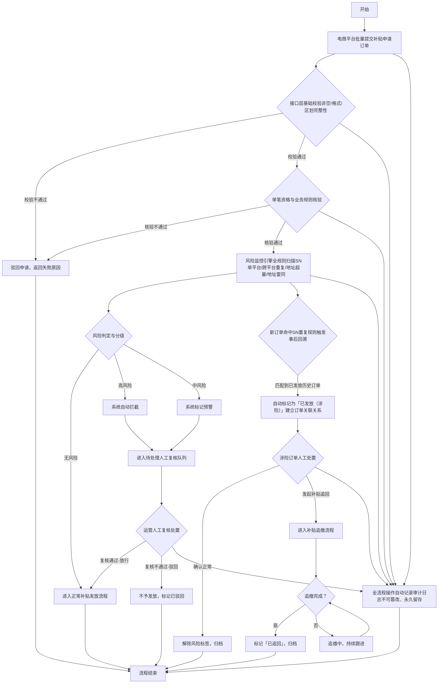

# 风险监控系统需求规格说明书

**公司名称**：北京中科江南信息技术股份有限公司  

**发布日期**：2026年3月19日

**版本**：V1.0  

**作者**：XXX  

**修改日期**：2026.3.19  

**更新内容**：新建风险监控系统需求规格说明书，补充全功能模块在线原型链接、完善业务流程图及节点说明

## 1. 文档概述

### 1.1 编写目的

本文档为风险监控系统的需求规格说明书，明确系统的业务场景、功能边界、业务规则、交互逻辑、非功能要求及技术实现约束，为产品研发、测试验证、项目验收及运维迭代提供统一、无歧义的执行依据，保障系统实现补贴发放全流程风险管控，满足财政补贴资金安全监管与审计溯源要求。

### 1.2 术语定义

|术语|说明|
|---|---|
|SN码|商品唯一识别序列号，补贴申领商品身份校验的核心字段|
|风险订单|命中系统风险规则的补贴申请订单，分为高风险、中风险两个等级|
|批次|电商平台批量提交的补贴申请订单集合，以批次号作为唯一标识|
|涉险订单|已完成补贴发放，事后被关联命中风险规则的历史订单|
|尼斯分类|根据《商标注册用商品和服务国际分类尼斯协定》制定的商标分类体系，共45类|
### 1.3 参考资料

- 《尼斯分类表》（第12版）

- 财政补贴资金监管相关管理规范

- 公司内部系统研发与测试管理规范

## 2. 业务概述

### 2.1 业务场景

为防范财政补贴发放过程中出现的SN重复申领、地址批量伪造、同一地址超额申领等欺诈行为，搭建风险监控系统，覆盖补贴申请**事前实时风险拦截、事中人工复核处置、事后风险回溯追缴**全业务流程。

核心业务场景包括：

1. 运营人员可视化配置风险规则，调整校验阈值与处置策略，配置实时生效；

2. 系统对电商平台批量提交的补贴申请订单进行全量实时风险扫描，按规则自动分级处置；

3. 运营人员对风险订单进行人工复核，执行放行、驳回、追缴等处置动作；

4. 系统自动完成事后风险回溯，对已发放的涉险订单进行标记与关联溯源；

5. 管理人员通过可视化看板掌握全局风险态势，支撑管理决策与监管汇报；

6. 全流程操作留痕，满足审计溯源与监管合规要求。

### 2.2 用户角色

|角色名称|角色描述|核心操作权限|
|---|---|---|
|运营人员|负责日常风险规则维护、风险订单复核处置的一线业务人员|规则配置、风险订单查询/复核/处置、数据导出|
|管理人员|负责风险管控全局管理、决策的业务负责人|风险看板查看、数据统计分析、处置流程监督|
|审计人员|负责合规审计、操作溯源的监管人员|操作日志查询、风险处置全流程溯源、规则修改记录审计|
|系统管理员|负责系统权限配置、基础维护的技术人员|用户权限管理、系统参数配置、日志维护|
### 2.3 业务流程

本系统业务流程覆盖补贴申请**事前拦截、事中处置、事后回溯**全生命周期，全流程操作自动留痕，满足审计监管要求，完整流程图如下：

- **在线流程图链接**：【可补充XMind/WPS在线流程图链接，上述mermaid流程图可直接在支持mermaid语法的Markdown编辑器、语雀、GitBook、Confluence等平台直接渲染】

- **流程图核心节点说明**：

- 节点1（电商平台批量提交申请）：接收电商平台推送的补贴申请批次及订单数据，触发接口层格式校验，对应系统外部订单接收接口模块；

- 节点2（接口层基础校验）：校验订单数据非空、SN码格式、地址区划完整性，校验不通过直接驳回，校验通过进入单笔业务规则核验，过滤无效申请；

- 节点3（单笔资格与业务规则核验）：完成补贴申领基础资格校验，如申领人资质、商品品类合规性等，核验不通过直接驳回，核验通过进入风险扫描环节；

- 节点4（风险监控全规则扫描）：调用风险规则引擎，对订单执行4项核心风险规则全量扫描，输出风险判定结果，对应风险规则配置模块，扫描规则实时同步运营配置；

- 节点5（风险分级处置）：根据扫描结果自动分级：无风险订单直接进入补贴发放流程；高风险订单自动拦截、中风险订单标记预警，均进入待处理人工复核队列；

- 节点6（人工复核处置）：运营人员在风险订单详情页查看风险详情与判定证据，对待处理订单执行放行/驳回操作，放行订单进入发放流程，驳回订单直接终止流程，所有操作必填备注，全程留痕；

- 节点7（事后风险回溯）：新订单触发SN重复规则时，系统自动回溯该SN对应的全量历史申请记录，匹配到已发放的历史订单后，自动标记为「已发放（涉险）」，并建立订单关联关系，可在详情页查看完整SN申请链路；

- 节点8（涉险订单处置）：运营人员对已发放涉险订单执行处置，确认正常则解除风险标签，确认违规则发起补贴追回，进入追缴流程，追缴完成后标记为「已追回」；

- 节点9（全流程审计留痕）：贯穿全流程所有操作节点，规则配置修改、订单处置、状态变更等所有操作均自动记录审计日志，日志不可篡改、永久留存，满足监管审计要求。

### 2.4 表单书式

|表单名称|适用场景|核心字段|
|---|---|---|
|风险规则配置表单|运营人员配置风险规则开关、阈值、自动处置策略|规则开关、统计周期、阈值数值、自动处置策略、操作人、操作时间|
|风险订单处置表单|运营人员对风险订单执行复核处置|处置动作、处置备注、操作人、操作时间|
|风险订单查询筛选表单|风险订单列表多条件查询|电商平台、风险等级、风险类型、处置状态、申请单号、SN码、时间范围|
### 2.5 系统衔接

1. **上游系统衔接**：与电商平台补贴申请对接系统衔接，接收批量提交的补贴申请订单数据，返回订单风险校验结果；

2. **下游系统衔接**：与补贴发放系统衔接，推送无风险订单及复核放行订单的发放指令，同步获取订单发放状态；

3. **关联系统衔接**：与补贴追缴流程系统衔接，支持对涉险订单发起追缴流程，同步追缴进度；

4. **内部系统衔接**：与统一权限管理系统衔接，实现用户身份认证与权限管控；与日志审计系统衔接，同步全流程操作日志。

### 2.6 功能清单

|序号|模块名称|菜单名称|功能描述|备注|
|---|---|---|---|---|
|1|风险规则管理|风险规则配置|支持运营人员配置4类风险规则的开关、校验阈值、自动处置策略，配置保存后实时生效，支持恢复默认配置|核心模块|
|2|风险订单管理|风险订单监控列表|支持风险订单全量展示、多条件筛选、批量处置、数据导出，区分实时拦截与事后涉险订单|核心模块|
|3|风险订单管理|风险订单详情|展示订单基础信息、风险信息与证据、SN关联订单全链路，支持人工复核处置与操作留痕|核心模块|
|4|风险监控可视化|风险监控看板|展示风险全局概览、风险类型分布、趋势变化、TOP排行与实时预警，支撑决策与监管|核心模块|
|5|系统管理|操作日志审计|记录规则配置、订单处置全流程操作日志，支持多条件查询与审计溯源|合规要求|
|6|系统管理|权限管理|基于角色配置用户系统操作权限，实现分级管控|基础模块|
## 3. 原型说明

### 3.1 原型文件链接

- **主原型链接**：https://modao.cc/proto/5s1sMw8Gtc4k3pL3MBCP1/sharing?view_mode=read_only

- **原型说明**：该原型为风险监控系统全量页面高保真原型，包含风险监控看板、风险订单列表、风险规则配置、审计溯源日志等核心功能页面，支持只读模式查看完整界面设计、交互逻辑与组件规范，原型版本为风险监控系统原型_v5。

### 3.2 原型规范说明

- **样式规范**：主色调#165DFF，辅助色#6B8FFF，警示色#FF4D4F；按钮圆角8px，字体宋体；所有输入框高度40px，边框1px solid #E5E6EB；高风险等级标签使用警示色高亮展示；

- **响应式规范**：PC端（≥1200px）、平板端（768px-1199px）、移动端（≤767px），原型已标注各尺寸下的组件布局，开发需严格参考；

- **交互规范**：所有按钮点击颜色加深10%，弹窗弹出有淡入动画（时长0.3秒），页面跳转有滑动动画（时长0.5秒）；列表默认按高风险在前、待处理优先排序；操作按钮需做权限与状态控制，不可操作按钮置灰。

## 4. 业务功能

### 4.1 功能菜单

|菜单路径|适用角色|规则约束|
|---|---|---|
|风险规则管理-风险规则配置|运营人员、系统管理员|仅有权限用户可编辑配置，配置修改需记录操作日志，保存后实时生效|
|风险订单管理-风险订单监控列表|运营人员、管理人员、审计人员|仅运营人员可执行批量处置操作，审计人员仅可查看与导出，已发放涉险订单不可执行批量放行/驳回|
|风险订单管理-风险订单详情|运营人员、管理人员、审计人员|仅运营人员可执行处置操作，所有处置动作必须填写备注，处置后不可撤回，操作全程留痕|
|风险监控可视化-风险监控看板|管理人员、运营人员、审计人员|所有用户均可查看，数据按权限范围展示，实时刷新|
|系统管理-操作日志审计|审计人员、系统管理员|仅可查看，不可编辑、删除，日志永久留存|
---

### 4.1.1 功能概述：风险规则配置（TM-FXJK-001）

**功能名称**：风险规则配置

**功能描述**：支持运营人员可视化配置4类风险规则的开关、校验阈值、自动处置策略，提供保存配置、恢复默认配置功能，配置修改实时生效，全操作留痕。

- **前置条件**：用户已登录，拥有风险规则配置权限，页面加载成功

- **输入**：
       

    1. SN重复规则：SN单平台重复校验开关、SN跨平台重复校验开关

    2. 地址超量规则：地址统计周期（天，数字类型）、同一完整地址最大订单数（数字类型）

    3. 地址批量雷同规则：详细地址前缀截取长度（数字类型）、批量雷同判定订单数阈值（数字类型）

    4. 自动处理策略：高风险（SN重复）处置策略（自动拦截/仅标记）、中风险（地址异常）处置策略（自动拦截/仅标记）

- **输出**：
        

    1. 配置项实时回显，保存成功后弹出「配置保存成功，已实时生效」提示

    2. 恢复默认配置后，所有配置项重置为系统默认值

    3. 配置修改操作自动写入操作审计日志

- **规则约束**：
        

    1. 数字输入框仅支持输入正整数，不可为空、不可输入负数或非数字字符

    2. 规则开关关闭后，对应风险规则停止校验，不再触发风险判定

    3. 恢复默认配置需二次确认，防止误操作

- **后置条件**：配置保存后，实时更新风险规则引擎的校验规则，新提交订单按最新配置执行扫描

- **特殊异常处理**：网络异常导致保存失败时，保留当前编辑内容，弹出「保存失败，请检查网络后重试」提示，不可清空用户已编辑内容

#### 4.1.2 原型界面：风险规则配置页

- 原型链接：https://modao.cc/proto/5s1sMw8Gtc4k3pL3MBCP1/sharing?view_mode=read_only

- 界面说明：原型内可通过左侧导航菜单「风险规则配置」直接进入对应页面，页面分4个配置区块：SN重复规则配置区、地址超量规则配置区、地址批量雷同规则配置区、自动处理策略配置区；开关控件默认展示当前生效状态，数字输入框展示当前生效阈值；页面底部固定展示「保存配置」「恢复默认」按钮，按钮点击有二次确认弹窗；输入不合法时，输入框标红提示，「保存配置」按钮置灰不可点击。

#### 4.1.3 代码逻辑

【研发人员编写，说明功能编码实现逻辑、前后端衔接说明等】

#### 4.1.3 功能验证

##### 4.1.3.1 验证策略

|验证层次|验证方法|覆盖范围|通过标准|责任人|
|---|---|---|---|---|
|单元测试|自动化|Service层、规则引擎工具类|代码覆盖率≥80%，断言通过率100%|开发工程师|
|接口测试|自动化|RESTful API|Postman集合100%通过，入参校验全覆盖|测试工程师|
|集成测试|手工+自动化|与风险规则引擎、订单扫描模块、日志系统集成|配置保存实时生效，规则修改日志完整记录|测试工程师|
|功能验收|手工|端到端配置全流程|业务场景100%覆盖，规则约束0遗漏|产品人员/业务代表|
|性能测试|自动化|配置保存、规则引擎热更新|配置保存响应时间≤500ms，规则更新无延迟|性能测试工程师|
##### 4.1.3.2 测试用例

|用例编号|用例名称|前置条件|测试步骤|预期结果|优先级|关联需求|
|---|---|---|---|---|---|---|
|TC-FX001-001|规则配置保存成功|已登录，拥有配置权限，页面加载成功|1.修改规则开关与阈值 2.点击保存配置 3.二次确认|1.提示"配置保存成功，已实时生效" 2.配置项更新为最新值 3.操作日志完整记录|P0|FX001|
|TC-FX001-002|非法入参校验拦截|已登录，拥有配置权限，页面加载成功|1.在数字输入框输入负数/非数字字符 2.查看页面提示|1.输入框标红提示非法输入 2.保存按钮置灰不可点击|P1|BR-FX001-001|
|TC-FX001-003|恢复默认配置成功|已登录，拥有配置权限，已修改配置项|1.点击恢复默认 2.二次确认|1.所有配置项重置为系统默认值 2.操作日志完整记录|P1|BR-FX001-002|
---

### 4.1.1 功能概述：风险订单监控列表（TM-FXJK-002）

**功能名称**：风险订单监控列表

**功能描述**：全量展示命中风险规则的订单数据，支持多条件组合筛选、批量处置、数据导出，默认按高风险在前、待处理优先排序，区分实时拦截与事后关联风险订单。

- **前置条件**：用户已登录，拥有风险订单查看权限，页面加载成功

- **输入**：
        

    1. 筛选条件：电商平台、风险等级（高/中）、风险类型（4类）、处置状态、风险来源、申请单号/SN模糊搜索、提交时间范围

    2. 操作指令：批量放行、批量驳回、导出、详情查看

- **输出**：
        

    1. 渲染风险订单列表，展示对应字段，分页展示（默认每页20条，支持自定义每页条数）

    2. 筛选条件实时生效，列表按筛选结果刷新

    3. 批量操作执行后弹出对应结果提示，列表状态实时更新

    4. 导出功能生成Excel文件，包含当前筛选条件下的全量列表数据

- **规则约束**：
        

    1. 仅待处理状态的订单支持批量放行/批量驳回操作，其他状态订单操作按钮置灰

    2. 已发放（涉险）订单不可执行批量放行/驳回操作，仅支持查看详情

    3. 列表默认排序规则：高风险等级优先，同等级下待处理状态优先，同状态下按提交时间倒序

    4. 批量操作需二次确认，防止误操作

- **后置条件**：批量处置操作执行后，订单状态同步更新，操作记录写入审计日志，对应订单进入后续业务流程

- **特殊异常处理**：批量操作部分失败时，提示成功与失败数量，展示失败原因，不可中断已成功的操作

#### 4.1.2 原型界面：风险订单监控列表页

- 原型链接：https://modao.cc/proto/5s1sMw8Gtc4k3pL3MBCP1/sharing?view_mode=read_only

- 界面说明：原型内可通过左侧导航菜单「风险订单列表」直接进入对应页面，页面顶部为筛选条件区，支持多条件组合筛选与重置；筛选区下方为批量操作按钮区，包含批量放行、批量驳回、导出按钮；页面主体为风险订单列表，展示序号、申请单号、电商平台、批次号、SN码、完整收货地址、风险等级、风险标签、风险说明、订单状态、处置状态、操作人/时间、操作列；风险等级字段高亮展示，高风险为红色，中风险为橙色；列表底部为分页控件，支持页码跳转、每页条数调整。

#### 4.1.3 代码逻辑

【研发人员编写，说明功能编码实现逻辑、前后端衔接说明等】

#### 4.1.3 功能验证

##### 4.1.3.1 验证策略

|验证层次|验证方法|覆盖范围|通过标准|责任人|
|---|---|---|---|---|
|单元测试|自动化|Service层、分页工具类、导出工具类|代码覆盖率≥80%，断言通过率100%|开发工程师|
|接口测试|自动化|RESTful API|筛选条件、分页、批量操作接口100%通过|测试工程师|
|集成测试|手工+自动化|与订单数据库、处置流程模块、导出系统集成|列表数据准确，批量操作状态同步正确，导出文件完整|测试工程师|
|功能验收|手工|端到端列表全流程操作|业务场景100%覆盖，筛选、排序、操作约束0遗漏|产品人员/业务代表|
|性能测试|自动化|大数据量列表加载、筛选、导出|页面加载时间≤2s，接口响应时间≤500ms，万级数据导出无异常|性能测试工程师|
##### 4.1.3.2 测试用例

|用例编号|用例名称|前置条件|测试步骤|预期结果|优先级|关联需求|
|---|---|---|---|---|---|---|
|TC-FX002-001|列表默认加载成功|已登录，拥有查看权限，存在风险订单数据|1.进入风险订单监控列表页|1.页面加载完成，列表按默认规则排序展示 2.分页控件正常渲染|P0|FX002|
|TC-FX002-002|多条件筛选生效|已登录，列表加载成功|1.组合选择筛选条件 2.点击查询|1.列表按筛选条件刷新，展示匹配结果 2.筛选条件保留选中状态|P0|FX002|
|TC-FX002-003|批量放行待处理订单成功|已登录，列表存在待处理状态订单|1.勾选多条待处理订单 2.点击批量放行 3.填写备注并二次确认|1.提示"批量放行成功" 2.对应订单状态更新为已放行 3.操作日志完整记录|P0|FX002|
|TC-FX002-004|已发放涉险订单批量操作拦截|已登录，列表存在已发放（涉险）订单|1.勾选已发放（涉险）订单 2.查看批量操作按钮|批量放行、批量驳回按钮置灰不可点击|P1|BR-FX002-001|
---

### 4.1.1 功能概述：风险订单详情处置（TM-FXJK-003）

**功能名称**：风险订单详情处置

**功能描述**：展示风险订单全量信息，包括基础信息、风险详情与证据、SN关联订单全链路，支持运营人员针对不同状态订单执行对应处置动作，处置全程留痕，不可撤回。

- **前置条件**：用户已登录，拥有风险订单处置权限，从列表点击查看详情进入页面，订单数据加载成功

- **输入**：
        

    1. 处置动作：待处理订单→放行/驳回；已发放（涉险）订单→确认正常/发起补贴追回

    2. 处置备注（必填，文本类型）

- **输出**：
        

    1. 页面分区块渲染订单基础信息、风险信息、风险证据区、SN关联订单记录、处置操作区、处置日志

    2. 处置动作执行成功后，弹出对应提示，订单状态实时更新，处置记录同步至处置日志区

    3. 发起补贴追回动作后，自动推送订单信息至追缴流程系统，同步返回追缴流程编号

- **规则约束**：
        

    1. 所有处置动作必须填写备注，备注为空时，确认按钮置灰不可点击

    2. 处置动作执行后不可撤回，订单状态不可逆

    3. SN关联订单记录需展示该SN码下所有历史订单，按申请时间倒序排列，清晰展示订单状态与风险状态

    4. 风险证据需按风险类型分类展示，不可遗漏核心判定依据

- **后置条件**：处置动作执行后，订单状态同步更新至风险订单列表，操作记录写入审计日志，对应订单进入后续业务流程（发放/驳回/追缴）

- **特殊异常处理**：发起追缴流程对接失败时，保留当前处置状态，提示「追缴流程发起失败，请重试」，不可清空已填写的备注信息

#### 4.1.2 原型界面：风险订单详情页

- 原型链接：https://modao.cc/proto/5s1sMw8Gtc4k3pL3MBCP1/sharing?view_mode=read_only

- 界面说明：原型内可通过风险订单列表页操作列「查看详情」按钮进入对应页面，页面从上至下分为6个区块：订单基础信息区、风险信息区、风险证据区、SN关联订单记录区、处置操作区、处置日志区；风险信息区高亮展示风险等级、风险类型与风险描述；风险证据区按风险类型分tab展示，SN重复展示历史重复订单信息，地址超量展示周期与阈值数据，地址雷同展示相似前缀与示例订单；处置操作区按订单状态展示对应可操作按钮，不可操作按钮置灰；处置日志区按操作时间倒序展示所有操作记录，不可编辑。

#### 4.1.3 代码逻辑

【研发人员编写，说明功能编码实现逻辑、前后端衔接说明等】

#### 4.1.3 功能验证

##### 4.1.3.1 验证策略

|验证层次|验证方法|覆盖范围|通过标准|责任人|
|---|---|---|---|---|
|单元测试|自动化|Service层、处置流程逻辑、外部系统对接工具类|代码覆盖率≥80%，断言通过率100%|开发工程师|
|接口测试|自动化|RESTful API|详情查询、处置操作、追缴对接接口100%通过|测试工程师|
|集成测试|手工+自动化|与订单系统、追缴流程系统、日志系统集成|详情数据准确，处置状态同步正确，操作日志完整|测试工程师|
|功能验收|手工|端到端详情处置全流程|业务场景100%覆盖，处置规则0遗漏|产品人员/业务代表|
|性能测试|自动化|详情页加载、处置操作执行|页面加载时间≤2s，处置操作响应时间≤500ms|性能测试工程师|
##### 4.1.3.2 测试用例

|用例编号|用例名称|前置条件|测试步骤|预期结果|优先级|关联需求|
|---|---|---|---|---|---|---|
|TC-FX003-001|详情页加载成功|已登录，拥有查看权限，存在风险订单|1.从列表点击对应订单的查看详情按钮|1.页面加载完成，所有区块数据完整渲染 2.SN关联订单、风险证据展示完整|P0|FX003|
> （注：文档部分内容可能由 AI 生成）